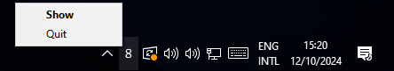
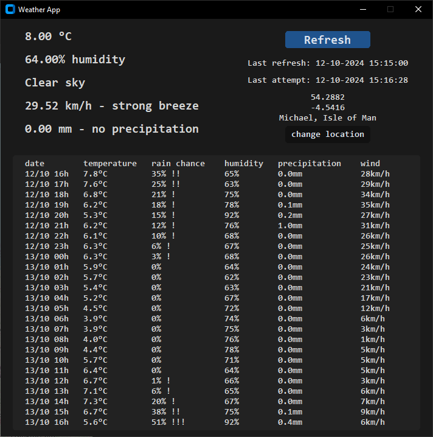

App developed for personal use since Microsoft's default weather "News and Interests" widget refuses to display the weather half the time, showing useless stock prices instead.
It periodically (~every 5 mins) calls the openmeteo api for current weather conditions and a future ~24hrs forecast. Every time the weather is fetched the system tray icon is updated to match the temperature value.
Personally useful when deciding whether I'll need a jacket if going out in the near future.

